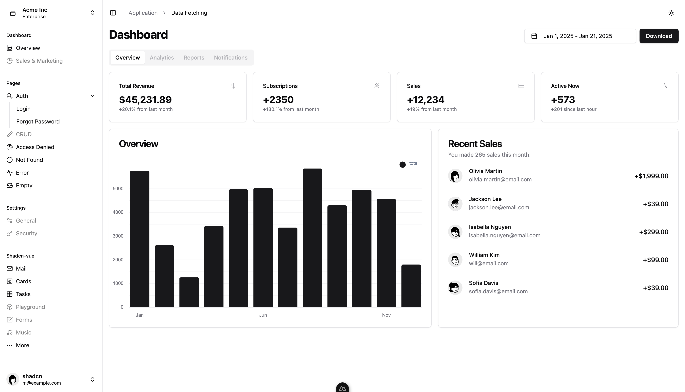

# Nuxt 3 Admin Template

Welcome to the **Nuxt 3 Admin Template Starter**, an advanced and modern admin dashboard built using [Nuxt 3](https://nuxt.com/) and the [shadcn-vue](https://www.shadcn-vue.com/). This project serves as a solid foundation for creating scalable, feature-rich admin panels.

> 🚧 **Note**: This template is currently under development and is not yet complete. Expect frequent updates and potential breaking changes.

---

## Features

- [x] ✨ [shadcn-vue](https://www.shadcn-vue.com/) Re-usable components built with Radix Vue, and Tailwind CSS.
- [x] 🌊 [@nuxtjs/tailwindcss](https://tailwindcss.nuxtjs.org/) The Tailwind CSS module for Nuxt
- [x] 🏀 [@nuxt/icon](https://github.com/nuxt/icon) The <Icon> component, supporting Iconify, Emojis and custom components
- [x] 🚀 [@vueuse/core](https://vueuse.org/) Collection of Vue Composition Utilities
- [x] 🍍 [@pinia/nuxt](https://pinia.vuejs.org/) The intuitive store for Vue.js
- [x] 📏 [@nuxt/eslint](https://eslint.nuxt.com/) All-in-one ESLint integration for Nuxt
- [x] 🧹 [Prettier](https://prettier.io/) Code formatter

---

## Acknowledgements

Special thanks to:

- [Nuxt.js](https://nuxt.com/)
- [shadcn-vue](https://www.shadcn-vue.com/)

## Setup

This project using `pnpm` as dependencies management

Make sure to install dependencies:

```bash
pnpm install
```

## Development Server

Start the development server on `http://localhost:3000`:

```bash
pnpm dev
```

## Production

Build the application for production:

```bash
pnpm build
```

Locally preview production build:

```bash
pnpm preview
```

Check out the [deployment documentation](https://nuxt.com/docs/getting-started/deployment) for more information.
